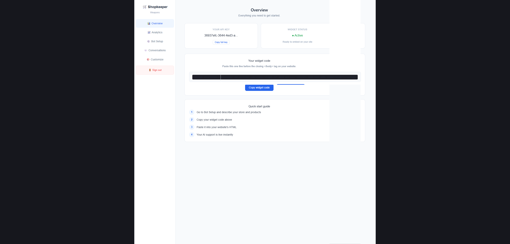
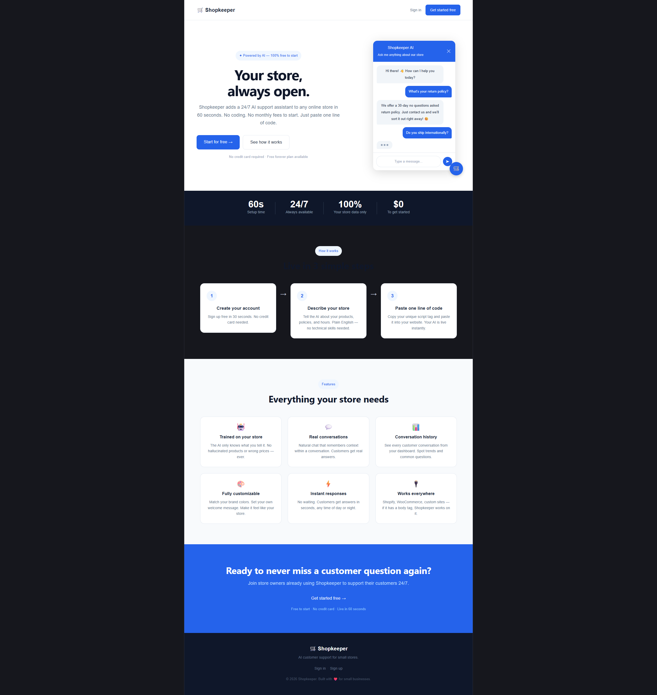

# 🧠 Shopkeeper — AI Customer Support SaaS

<p align="center">
  
  
  
  
  
</p>

<p align="center">
  <b>Turn any website into an AI-powered customer support machine in minutes.</b>
</p>

---

## 🚀 Live Demo

🌐 [https://shopkeeper-rho.vercel.app](https://shopkeeper-rho.vercel.app)

---

## ⚡ What is Shopkeeper?

Shopkeeper is a **multi-tenant AI SaaS platform** that allows businesses to:

* Embed an AI chatbot into their website
* Answer customer queries instantly
* Train the bot using business-specific context
* Manage conversations via a dashboard

---

## 🧩 Core Features

* 🧠 AI-powered responses (Groq LLM)
* 💬 Real-time chat widget
* 🏢 Multi-tenant SaaS architecture
* 🔐 Secure authentication (Supabase Auth)
* 📊 Conversation logging
* 🎨 Custom branding per business
* ⚡ Embeddable JS widget (plug & play)

---

## 🏗️ System Architecture

```
User Website → JS Widget → FastAPI Backend → Groq LLM
                                 ↓
                              Supabase DB
```

---

## 🖥️ Screenshots

### Dashboard



### Landing



---

## ⚙️ Tech Stack

| Layer    | Technology            |
| -------- | --------------------- |
| Frontend | React + Vite (Vercel) |
| Backend  | FastAPI (Render)      |
| Database | Supabase              |
| Auth     | Supabase Auth         |
| AI       | Groq (LLaMA 3.1 8B)   |
| Widget   | Vanilla JavaScript    |

---

## 🧪 Local Development

```bash
# Clone repo
git clone https://github.com/asifsharan10/shopkeeper.git

# Backend
cd backend
pip install -r requirements.txt
uvicorn main:app --reload

# Frontend
cd frontend
npm install
npm run dev
```

---

## 🔑 Environment Variables

### Backend

```
GROQ_API_KEY=
SUPABASE_URL=
SUPABASE_KEY=
```

### Frontend

```
VITE_API_URL=
```

---

## 🛣️ Roadmap

* 💳 Stripe subscription integration
* 📧 Email notifications
* 📊 Analytics dashboard
* 🌍 Custom domain support

---

## 💡 Why this project stands out

* Built a **production-ready SaaS** (not just a demo)
* Designed **multi-tenant architecture from scratch**
* Integrated **LLMs into real-world use case**
* Achieved **zero-cost deployment**
* Created a **plug-and-play developer product**

---

## 👨‍💻 Author

**Asif Sharan**

GitHub: [https://github.com/asifsharan10](https://github.com/asifsharan10)

---

## ⭐ Support

If you like this project, consider giving it a ⭐ on GitHub — it helps a lot!
